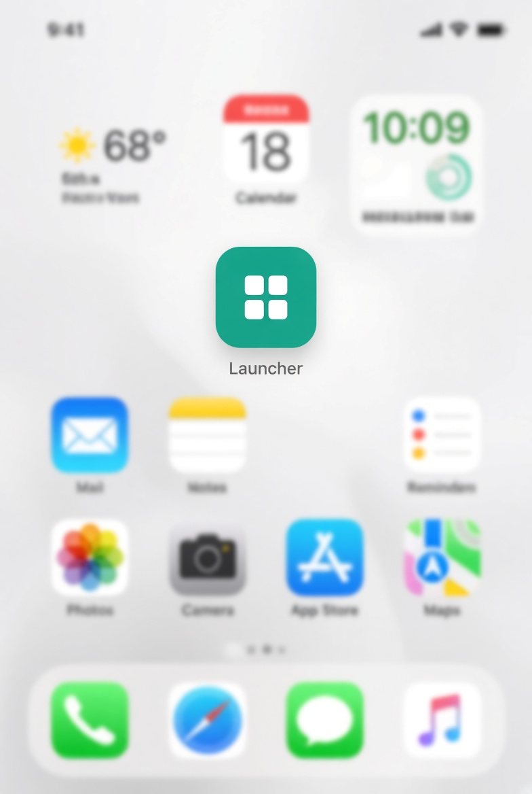
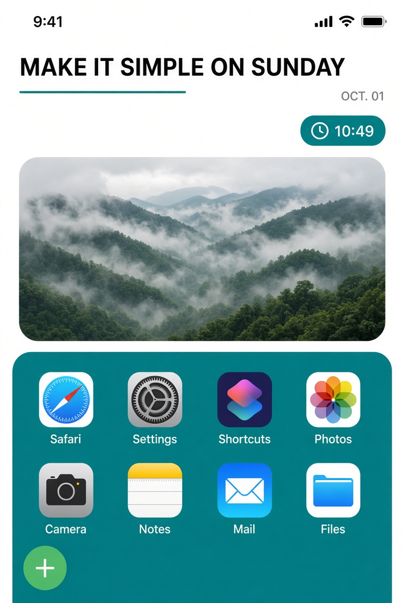
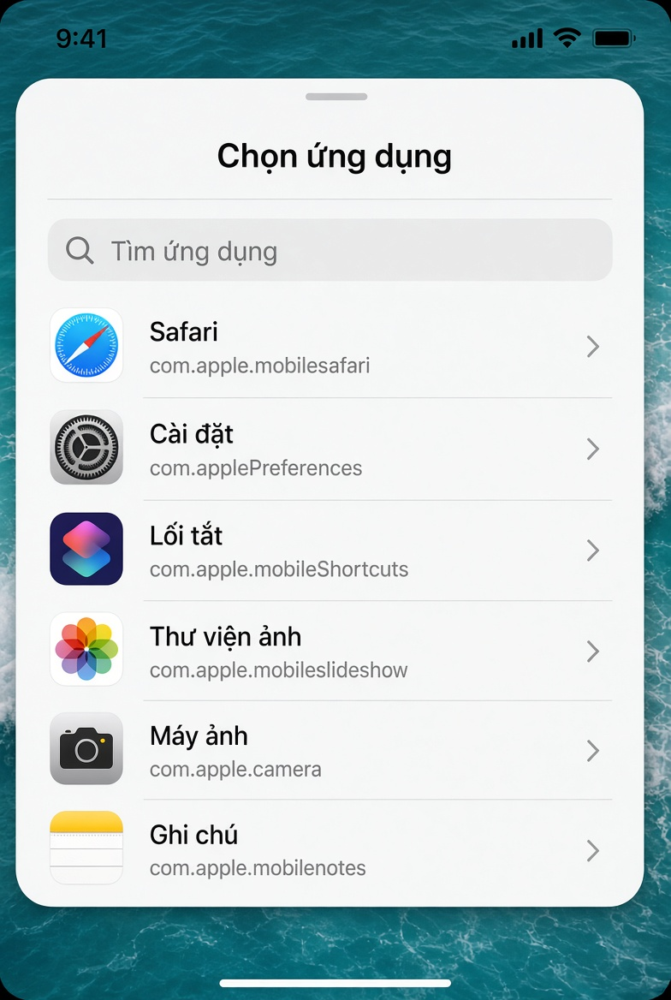

# Launcher IOS

Mở app trên iPhone từ một dock riêng. Gắn lên màn hình chính, bấm icon là chạy — không lục thư viện.

[Mở trang](https://dammeiosvn.github.io/Launcher-IOS/) · [Tải hồ sơ cài](https://dammeiosvn.github.io/Launcher-IOS/LauncherIOS.mobileconfig)

<p>
  
  
  
</p>

Ảnh trên là minh họa bố cục, không phải ảnh chụp máy.

## Cài

1. Trên iPhone, bấm [Tải LauncherIOS.mobileconfig](https://dammeiosvn.github.io/Launcher-IOS/LauncherIOS.mobileconfig).
2. Cho phép Safari tải hồ sơ.
3. Vào **Cài đặt → Đã tải về hồ sơ**, chọn **Launcher IOS**, bấm **Cài đặt**.
4. Mở [trang](https://dammeiosvn.github.io/Launcher-IOS/), **Chia sẻ → Thêm vào Màn hình chính**.

Link dự phòng nếu Safari không nhận hồ sơ: [bản raw trên GitHub](https://github.com/dammeiosvn/Launcher-IOS/raw/main/LauncherIOS.mobileconfig).

Hồ sơ chỉ mở webclip và icon. Không xin quyền khác.

## Cần có

Shortcut phải tên đúng **Quick Launcher**. Dock gửi bundle ID sang shortcut:

```text
shortcuts://run-shortcut?name=Quick%20Launcher&input=text&text=BUNDLE_ID
```

Chưa có shortcut thì icon trên dock không mở được app.

## Dùng

- **+** thêm app. Tìm trong danh sách hệ thống hoặc App Store. Tối đa 8.
- Giữ icon để xóa.
- Bánh răng: lưới, danh sách, đổi tên, thông tin.
- Ảnh đầu trang: chọn ảnh, kéo khung, xác nhận.
- Sáng tối theo máy.

## Trong repo

| File | Việc |
| --- | --- |
| `index.html` | Trang launcher |
| `icon-home-screen.png` | Icon màn hình chính |
| `LauncherIOS.mobileconfig` | Hồ sơ cài nhanh |
| `System/SystemApp.json` | Tên và bundle ID |
| `systemapp/` | Icon từng app |

Phiên bản 1.0.
